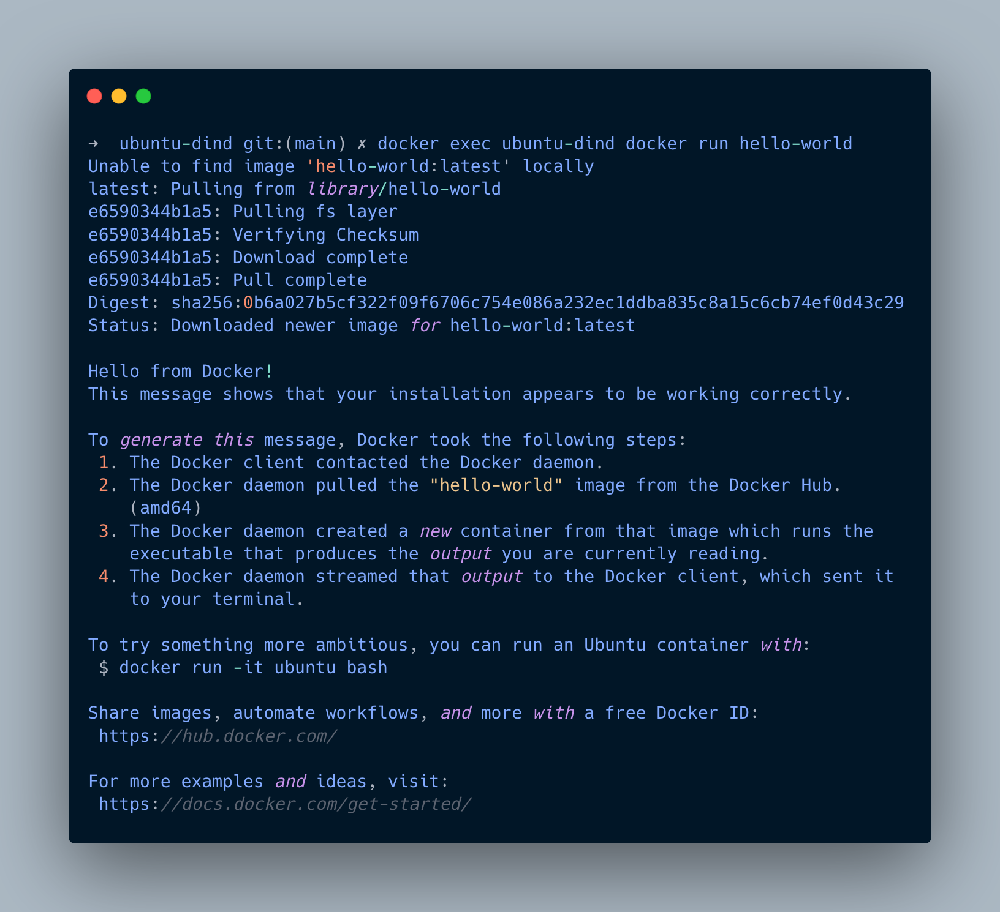
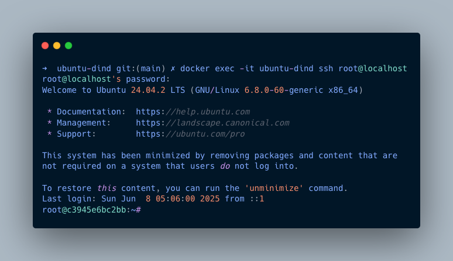

# 🐳 Ubuntu DIND (Docker-in-Docker)

[](https://github.com/luutuankiet/dind-ubuntu/actions/workflows/CD.yml)

## 🚀 What's This?

A developer-friendly take on Docker-in-Docker! 🛠️ While the official Docker DID image is Alpine-based, this Ubuntu-flavored variant brings the familiar `apt` package manager and SSH server out-of-the-box for those who prefer the Ubuntu ecosystem.

Perfect for **home labs**, **CI/CD pipelines**, and **development environments** where you need Docker running inside Docker with the comfort of Ubuntu's tooling! 

## ⚠️ **Important: Privileged Mode Required!**

🔐 **Always run with `--privileged` flag** - This container needs access to the host Docker engine to spawn its own containers. Without it, Docker-in-Docker won't work! 

## ✨ Two Flavors to Choose From

### 🎯 **Slim** - Minimalist Approach
- Clean Ubuntu base with Docker + SSH
- Install tools on-demand with handy `install-*` scripts
- Lightweight and fast startup ⚡

### 🔧 **Full** - Batteries Included  
- Everything from Slim, plus:
- Google Cloud CLI (`gcloud`) 
- Terraform
- Node.js
- Ready for immediate productivity! 

## 🏃‍♂️ Quick Start

### Pull the Images

Docker pull command for full version:
```bash
docker pull boyluu96/ubuntu-dind:latest
```

Docker pull command for slim version:
```bash  
docker pull boyluu96/ubuntu-dind:slim
```

### 🎮 Try It Out

Start a container with Docker-in-Docker (note the --privileged flag):
```bash
docker run --privileged -d --name ubuntu-dind boyluu96/ubuntu-dind:slim
```

Test Docker inside the container:
```bash
docker exec ubuntu-dind docker run hello-world
```



SSH into your container (password: `admin`):
```bash
docker exec -it ubuntu-dind ssh root@localhost
```




### 🧪 Try the Slim Version

Start slim container:
```bash
docker run --privileged -d --name ubuntu-dind-slim boyluu96/ubuntu-dind:slim
```

## 🎯 Perfect For

- **self hosted CI/CD Runners** - Ubuntu-based build environments (github action already provide this OOTB.)
- **Development Sandboxes** - Isolated Docker environments  
- **Home Lab Projects** - Self-hosted automation and testing
- **Learning & Experimentation** - Safe Docker playground 🎪

## 🔧 On-Demand Tools (Slim Version)

Need additional tools? No problem! Use the built-in installers:

Example installing gcloud:
```bash
docker exec ubuntu-dind-slim install-gcloud
```

Available installers: `install-gcloud`, `install-terraform`, `install-node` (more to come, checkout the available scripts in dockerfile source code.)


